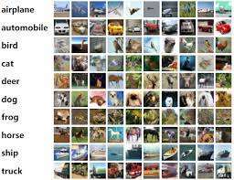

# Understanding Convolutional Neural Networks using CIFAR-10 Dataset
(2051 words, 9 minutes reading time)

#### Author: Atharva Pargaonkar

## What are Artifical Neural Networks ?

The term "Artificial Neural Network" is derived from Biological neural networks that develop the structure of a human brain. Similar to the human brain that has neurons interconnected to one another, artificial neural networks also have neurons that are interconnected to one another in various layers of the networks. These neurons are known as nodes. ANN is also known as a Feed-Forward Neural network because inputs are processed only in the forward direction.

The nodes in ANN are organized in a series of layers that make up entire Artificial Neural Network system. A layer can include any number of neurons, depending on the complexity of the neural network. More complexity leads to better understanding of the hidden patterns in the dataset. The artificial neural network takes input and computes the weighted sum of the inputs and includes a bias. This computation is represented in the form of a transfer function or activation function. It determines weighted total is passed as an input to an activation function to produce the output. Activation functions choose whether a node should fire or not. 

An Artificial Neural Network typically contains an input layer, hidden layers and an output layer. The input layer gets information from the dataset is then processed through one or more hidden layers. The output layer gives an output in the form of an Artificial Neural Network reesponse to the input data provided. The majority of neural networks connect nodes from one layer to the next. Each of these links has weights that define how much influence one node has on another. As data is sent from one node to another, the neural network learns more about the data, resulting in an output from the output layer. 

Artificial Neural Networks have certain limitations when used in image recognition tasks. ANNs are ineficient in handling large image datasets due to the requirement of large computational resources and a significant number of parameters. 

To overcome this issue, Convolutional Neural Networks (CNNs) are specifically designed which can capture spatial relationships efficiently. CNNs are the ideal choice for this CIFAR-10 project due to their expertise in image processing, feature extraction, invariance to image variations, parameter efficiency, and proven track record of success in image classification

## What is a Convolutional Neural Network?
### Overview of Convolutional Neural Network (CNN)

A convolutional neural network (CNN/ConvNet) is a type of deep neural network in the field of deep learning. It is a more advanced type of artificial neural networks (ANN) that is commonly used to extract features from grid-like matrix datasets. CNNs are inspired by the visual cortex of the human brain, where individual neurons respond to stimuli only in a restricted region of the visual field. CNNs are designed to recognize patterns in data, such as images, and are commonly used in computer vision tasks such as image classification, object detection, and image segmentation. In this blog, we will deep dive into the architecture of CNNs and we will also see how to implement a CNN model on the CIFAR-10 dataset using the deep learning approach.

### Architecture of CNN

Convolutional Neural Network consists of different layers in a seqeuntial manner. These main layers in a CNN are the input layer, Convolutional layer, Pooling layer, and fully connected layers. Each layer is responsible for building on the features detected in the previous layers—from lines, to contours, to shapes, to entire objects. Let's take a look about each layer in detail:

#### 1. Input Layer

The input layer serves as the entry point for the raw input data. It typically consists of a multidimensional array of pixels, representing an image or other visual data. The dimensions of the input layer are determined by the size and format of the input data. For example, if the input data consists of RGB images of size 224 x 224 pixels, the input layer would have a shape of (224, 224, 3), where 3 represents the three color channels (red, green, and blue). The shape will be (224, 224, 1) for grayscale images. 

#### 2. Convolution Layer

The convolutional layer is responsible for extracting features from the input data. It applies a filter or kernel, a small matrix of weights, to the input data, identifying patterns like edges, corners, and textures. The filter slides across the input, performing a mathematical operation called convolution, producing a feature map that highlights specific features in the input. There are three main operations in a convolution layer which are as follows:
 
 - Convolution Operation: The convolution operation involves sliding the filter across the input data, element by element, and performing element-wise multiplication and summation. The resulting feature map represents the response of the filter to the input data, highlighting areas where the filter's pattern matches the input.
 
 - Feature Extraction: The convolutional layer extracts features by applying multiple filters, each capturing different patterns in the input data. The feature maps generated by these filters provide a rich representation of the input, allowing the network to learn complex patterns.
 
 - Parameter Sharing: The same filter is applied across the entire input, reducing the number of parameters the network needs to learn. This makes the network more efficient and less prone to overfitting.

#### 3. Pooling Layer

The pooling layer in convolutional neural networks (CNNs) reduces the dimensionality of feature maps while retaining important information. It summarizes the extracted features, making the network more efficient and less prone to overfitting. This downsampling operation decreases the computational burden of subsequent layers and makes the network more efficient.

Common Pooling Methods in training a neural network are:
- Max Pooling: Max pooling computes the maximum value within a pooling region, preserving the most prominent features. It is effective for tasks like object detection where identifying strong features is important.
- Average Pooling: Average pooling computes the average value within a pooling region, providing a smoother representation of the features. It is useful for tasks like image segmentation where preserving spatial information is important.

#### 4. Fully Connected Layer

Fully connected layers are the final layers in a convolutional neural network (CNN). They are also referred as 'Dense Layers'. Fully Connected layers are responsible for making predictions based on the features extracted by the convolutional and pooling layers. Each neuron in a fully connected layer is linked to every other neuron in the previous layer, therefore making it simalar to ANN architecture. Fully connected layers introduce non-linearity through activation functions, allowing the network to model complex decision boundaries and learn intricate patterns. Common activation functions include ReLU, sigmoid, and tanh.

#### 5. Output Layer

The output layer is the final layer in a convolutional neural network (CNN). It receives the processed information from the preceding layers and generates the final output, which can be a classification label, a probability distribution over classes, or a continuous value for regression tasks. The output layer is the culmination of a CNN's processing pipeline, transforming the extracted features into meaningful predictions. By generating the final output, the output layer enables CNNs to perform various tasks, from classifying images to predicting continuous values, making them versatile tools for machine learning applications. 

## Dataset Description
In this project we would be using the CIFAR-10 dataset which is a widely used benchmark for machine learning and deep learning research. It is a relatively small dataset, but it is still challenging to achieve high accuracy on it. The best-performing models on the CIFAR-10 dataset have achieved accuracy of over 90%.

The CIFAR-10 dataset is used for a variety of tasks, including:
 - Image classification
 - Object detection
 - Image segmentation
 - Image retrieval

The CIFAR-10 dataset is available for free from the Canadian Institute for Advanced Research (CIFAR).

The CIFAR-10 dataset consists of 60000 32x32 colour images in 10 classes, with 6000 images per class. There are 50000 training images and 10000 test images. The dataset is divided into five training batches and one test batch, each with 10000 images. 
The test batch contains exactly 1000 randomly-selected images from each class. The training batches contain the remaining images in random order, but some training batches may contain more images from one class than another. Between them, the training batches contain exactly 5000 images from each class.

The classes in the dataset are airplane, automobile, bird, cat, deer, frog, dog, horse, ship and truck.

The classes are completely mutually exclusive. There is no overlap between automobiles and trucks. "Automobile" includes sedans, SUVs, things of that sort. "Truck" includes only big trucks.

## Training and Optimization of CNNs

Training a convolutional neural network (CNN) involves optimizing its parameters (weights and biases) to minimize the error between the network's predictions and the ground truth labels. The training process involves several key steps in the following order:

1. Data Preparation: Preprocessing the data includes crucial steps like normalization, resizing, or augmentation to ensure consistency and improve generalization.

2. Model Initialization: In this step, the CNN model is initialized with random weights and biases. These initial values are important for the training process as they determine the starting point for optimization.

3. Forward Propagation: During forward propagation, the input data is fed through the CNN layers, and the network generates predictions. The output of each layer is computed using the weights, biases, and activation functions.

4. Loss Calculation: The loss function measures the difference between the network's predictions and the ground truth labels. It quantifies the error made by the model and provides a feedback signal for optimization.

5. Backpropagation: Backpropagation calculates the gradients of the loss function with respect to the network's weights and biases. These gradients indicate how much each parameter contributes to the error.

6. Epochs and Batches: Training is typically done in multiple epochs, where the entire dataset is passed through the network multiple times. Each epoch is divided into batches, which are smaller subsets of the data used for efficient gradient computation.

7. Regularization: Regularization techniques, such as dropout or L2 regularization, are often employed to prevent overfitting. These techniques penalize large weights or introduce noise to make the model less sensitive to specific features in the training data.

8. Validation and Hyperparameter Tuning: During training, the model's performance is evaluated on a validation dataset, separate from the training data. Hyperparameters, such as learning rate or regularization strength, are adjusted to optimize performance on the validation set.

Once training is complete, the model with the best performance on the validation set is finalize which is then evaluated on a test dataset to assess its performance on unseen data.

## Applications of CNN

Convolutional neural networks have revolutionized various fields, demonstrating remarkable capabilities in image recognition, natural language processing, and many other tasks. Some prominent applications of CNNs include Image Classification/Segmentation, Object Detection, NLP and Medical Imaging. Let's talk about them in detail:

1. Image Classification and Segmentation : CNNs excel at classifying images into categories which well defined labels. They can also precisely segment images into different regions by identifying outlining boundaries.

2. Object Detection: CNNs can detect and localize multiple objects within an image, identifying their positions and bounding boxes. They are widely used in applications like self-driving cars, surveillance systems, and image search engines.

3. Natural Language Processing (NLP): NLP tasks like sentiment analysis, text classification, and machine translation use CNN to extract features from text sequences and learn patterns for various linguistic tasks.

4. Medical Imaging: Tumor detection, lesion segmentation, and disease diagnosis are some of the medical procedures which can be easily carried out using CNNs. They can analyze medical images with high accuracy, aiding in early detection and treatment planning.

## Conclusion

In conclusion, convolutional neural networks (CNNs) have emerged as a transformative force in the field of artificial intelligence, revolutionizing the way we process and analyze visual and textual data. Their ability to extract complex patterns and learn complicated representations has propelled them to the forefront of image recognition, natural language processing, and numerous other applications.Their ability to learn directly from raw data, without the need for handcrafted features, has opened up new possibilities in various domains, from medical imaging to autonomous vehicles. I believe that as research in deep learning continues to advance, CNNs are likely to play an even more prominent role in the future.  
